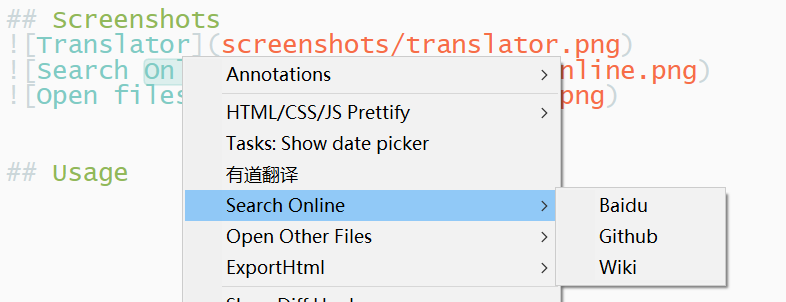
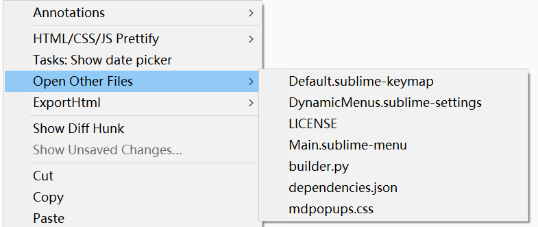

# DynamicMenus

[README](README.md)

## 功能

- 翻译单词和句子，漂亮地显示结果，复制翻译结果或用翻译结果替换原文。
   

- 打开浏览器，搜索选定的句子, 可以定制搜索引擎列表。
   

- 鼠标右键打开当前目录下的其他文件。
   

## 快捷键
- 你可以使用快捷键 <kbd>ctrl+shift+y</kbd> 来翻译光标所在处的单词或选中的句子。

## 高级用法

去[有道翻译官网](https://ai.youdao.com/)注册有道翻译应用接口， 创建一个翻译应用并复制 app-key 来天道设置文件中，有道首先会赠送你`￥100`的余额。

网上有很多关于这方面的内容。

下图是使用了自己的`app-key`的翻译示例，可以对比一下上面的没有使用`app-key`的翻译。

## TODO
- [x] 预处理翻译内容；
- [x] 复制翻译结果；
- [x] 用翻译替换原文；
- [ ] 为`解释`栏添加复制和替换按钮；
- [ ] 复制结果和替换原文的快捷键；
- [ ] 提高翻译结果的显示；
- [ ] 考虑是否缓存翻译内容；
- [ ] 打开当前目录下的其他文件的快捷键；
- [ ] 考虑是否将这三种功能分离成为三个独立的插件，并增强功能。
